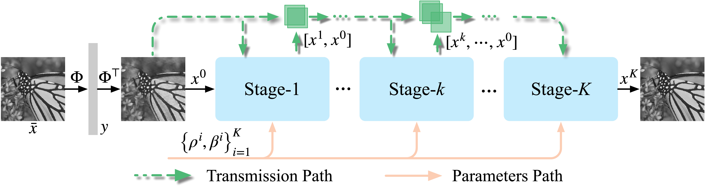
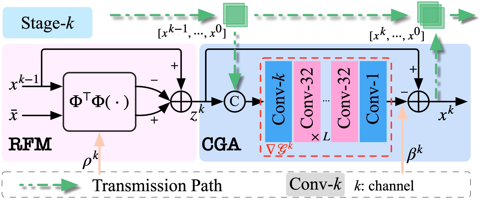
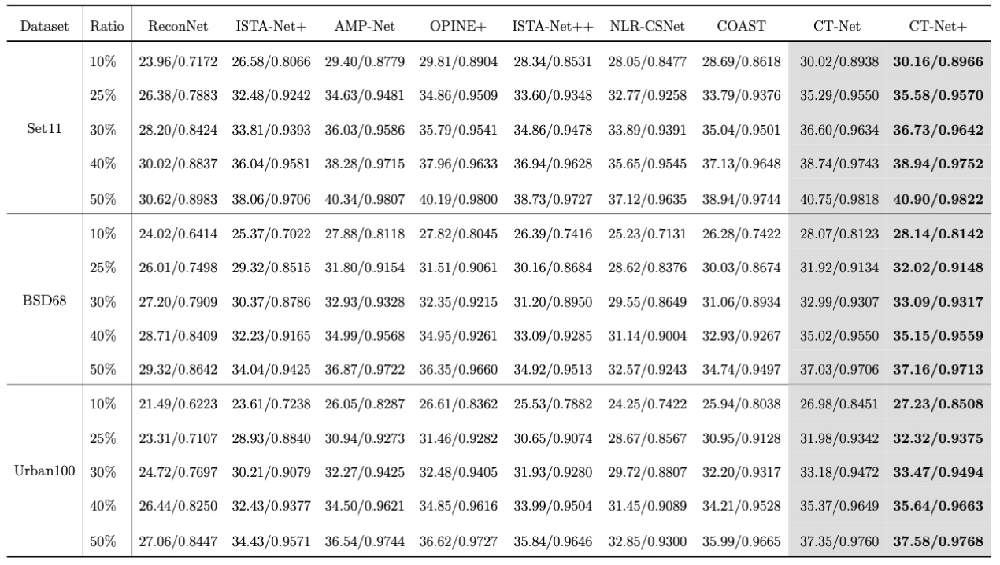

# CT-Net
📌 Official implementation of CT-Net: Optimization-inspired Cumulative Transmission Network for Image Compressive Sensing

> [**Optimization-inspired Cumulative Transmission Network for Image Compressive Sensing**](https://www.sciencedirect.com/science/article/abs/pii/S095070512300713X) <br>
> [Tianfang Zhang](https://tianfang-zhang.github.io/), [Lei Li](https://di.ku.dk/english/staff/?pure=en/persons/702491), [Zhenming Peng](https://idiplab.uestc.cn/queryNews?htmlid=1545286321065) <br>
> University of Electronic Science and Technology of China, University of Copenhagen

## Introduction 
We propose the optimization-inspired Cumulative Transmission Network (CT-Net), a DUN approach for natural image CS. 
We formulate an optimization procedure introducing an auxiliary variable similar to Half Quadratic Splitting (HQS). Unfolding this procedure defines the basic structure of our neural architecture, which is then further refined.
A CT-Net is composed of Reconstruction Fidelity Modules (RFMs) for minimizing the reconstruction error and 
Constraint Gradient Approximation (CGA) modules for approximating (the gradient of) sparsity constraints instead of relying on an analytic solutions such as soft-thresholding. Furthermore, a lightweight Cumulative Transmission (CT) between CGAs in each reconstruction stage is proposed to facilitate a better feature representation. Experiments on several widely used natural image benchmarks illustrate the effectiveness of CT-Net with significant performance improvements and fewer network parameters compared to existing state-of-the-art methods. The experiments also demonstrate the scene and noise robustness of the proposed method.

## Network Architecture

<p align="center">
    
    <br> Figure 1. Illustration of the CT-Net network architecture.
</p>
<p align="center">

<p align="center">
    
    <br> Figure 2. Illustration of the reconstruction stage k.
</p>
<p align="center">


## Test

Run the following command to evaluate a pre-trained CT-Net on a single GPU:

<pre>
python scripts/test_ctnet.py --data_dir {$my_data_dir} --pkl-path checkpoints/ctnet_cs25_stage9_hemlayer6_hemchannel32.pkl --cs-ratio 25 --stage-num 9
</pre>

This should give:

<pre>
Data: set11, PSNR: 35.2924, SSIM: 0.9550
Data: bsd68, PSNR: 31.9069, SSIM: 0.9134
Data: urban100, PSNR: 31.9765, SSIM: 0.9342
</pre>

Here are the command lines for evaluating other pre-trained models:

<details>
<summary> CT-Net: cs_ratio in [10, 25, 30, 40, 50] </summary>
<pre>
python scripts/test_ctnet.py --data_dir {$my_data_dir} --pkl-path checkpoints/ctnet_cs{$cs_ratio}_stage9_hemlayer6_hemchannel32.pkl --cs-ratio {$cs_ratio} --stage-num 9
</pre>
</details>

<details>
<summary> CT-Net Plus: cs_ratio in [10, 25, 30, 40, 50] </summary>
<pre>
python scripts/test_ctnet.py --data_dir {$my_data_dir} --pkl-path checkpoints/ctnet_cs{$cs_ratio}_stage15_hemlayer6_hemchannel32.pkl --cs-ratio {$cs_ratio} --stage-num 15
</pre>
</details>


## Train

Before training, please download [train data](https://drive.google.com/file/d/1NECjmVq5l_W6wR9U-yf0pJ3HdKU6HKHT/view?usp=sharing) and [finetune data](https://drive.google.com/file/d/11Rnq_Uai-8YHp0Mn2pIeZgmUxX_Qn9VQ/view?usp=sharing) from Google Drive.

To train a CT-Net model on a single GPU for 180 epochs and finetune 50 epochs, run:

<pre>
python scripts/train_ctnet.py --cs-ratio {$cs_ratio} --stage-num 9
</pre>

To train CT-Net Plus model on a single GPU:

<pre>
python scripts/train_ctnet.py --cs-ratio {$cs_ratio} --stage-num 15
</pre>

## Result

<center style="font-size:14px;color:#C0C0C0;">Table 1. Comparison of average PSNR/SSIM for different CS ratios on Set11, BSD68 and Urban100.</center> 
<center class="half">
    
</center>


## Citation

```
@article{zhang2023optimization,
  title={Optimization-inspired Cumulative Transmission Network for image compressive sensing},
  author={Zhang, Tianfang and Li, Lei and Peng, Zhenming},
  journal={Knowledge-Based Systems},
  pages={110963},
  year={2023},
  publisher={Elsevier}
}
```
